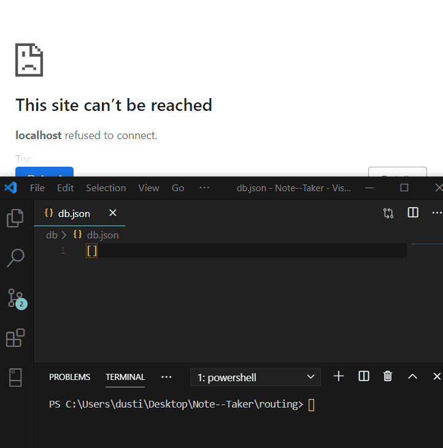
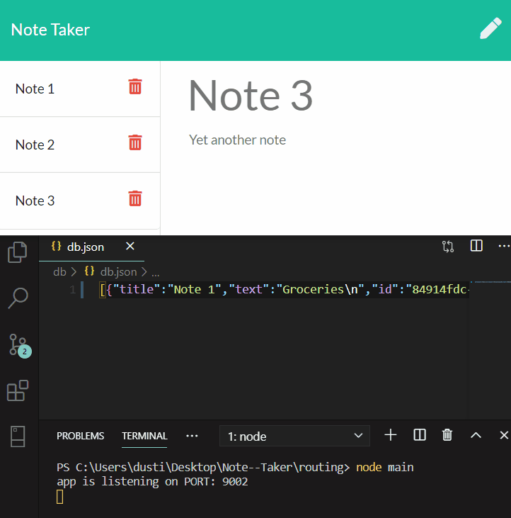

# Note-Taker
Backend solution to the Note Taker app.

## Saving to Database

 The database works! Entering a title and body to the note will populate a save icon.
  Once clicked, the icon will save the note to the local database @ db.json. Using the
  uuid npm package, a unique ID is generated for each note entered. (Props to TA Jason 
  Roundtree for helping me find that package - sup, Jason!) 

  
  
  
  
## Deleting from Database

 Clicking the trashcan will likewise delete each note based on its unique ID. This is 
    accomplished by looping through the db.json and using .splice() from the array, which
    looks for the unique uuid. 

    

## Process

 This project was pretty cool! My favorite part about homework is building app functionality.
  It's so nice having the HTML/CSS/JavaScript out of the way - this let me focus entirely on the 
  solution of routing and messing with the db.json. Although the frontend JavaScript has been my
  favorite part overall, this was nice to see how the backend can be used to slowly piece together 
  a fully-fledged app. 

  

 The routing was pretty easy to figure out. I tackled this homework right after we learned how 
  to route on the backend. Once I did that, it wasn't hard to hammer out an fs.writefile to save 
  to db.json. After I got that far, once I realized the notes didn't automatically delete, I hit
  a huge wall. That's where I went: "I literally have no idea how to solve this". Which leads to: 

  
  #### Challanges
  
  
 My first major challenge prevented me from even starting the homework. The app looked broken,
  and it took me reaching out to TA Robert Boespflug, who I saw posted that the homework needed the
  line: 
  
  //*app.use(express.static("public"));*//
  
  One line of code later, I was up and running. 
  
  The second challenge I already touched on - I had all functionality built in really quick until I
  reached deleting objects from the db.json database. It took me reaching out to Jason, who knew 
  instantly to point me to npm uuid. With that lead, I went off, read the documentation, threw my
  head against the syntax, and eventually had unique ID's in my database. This let me pick out the 
  ID in a loop and splice each note out. 

  
  #### Closing Thoughts
  
  
 I liked how much we were allowed to focus on the backend. If we had to do that along with the
  backend, I would have spent twice as long on this project.
  
  This was also the first time I reached out to a TA! Two of them, in fact! I normally like throwing 
  myself at something on my own, I feel like that's the best way for me to learn. But it's great to 
  know I have a parachute if I need one. And those parachutes are just so darn handsome, too. 

